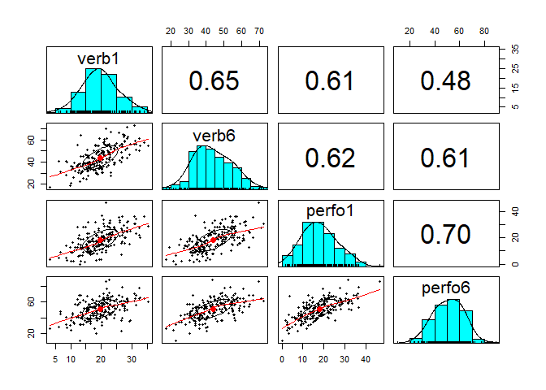
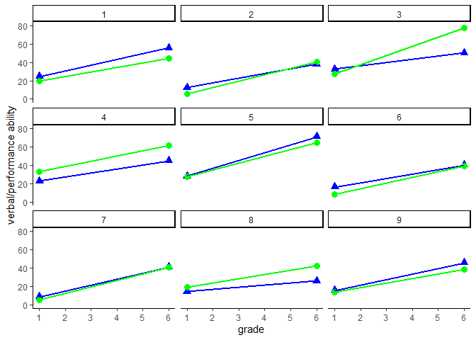

APIM (portfolio 2)
================
Yoo Ri Hwang
unknown

# Source:

I used the data and follow the general tutorial of this website:

<https://quantdev.ssri.psu.edu/tutorials/actor-partner-interdependence-model-apim-basic-dyadicbivariate-analysis>

and these following referneces:

<https://bigdata.duke.edu/projects/actor-partner-interdependence-model-r-mental-and-physical-health-spouses>

<https://rdrr.io/github/RandiLGarcia/dyadr/man/apim.html>

<https://randilgarcia.github.io/week-dyad-workshop/Distinguishable.html#distingushable_dyads>

However, I try to explain by myself and make changes.

# Overview

APIM model for distinguishable dyads. (Two intercept approach)

## Prepare for analysis

packages

``` r
library(ggplot2)   
```

    ## Warning: package 'ggplot2' was built under R version 4.1.3

``` r
library(nlme)     
library(psych)     
```

    ## Warning: package 'psych' was built under R version 4.1.3

``` r
library(reshape)   
```

    ## Warning: package 'reshape' was built under R version 4.1.3

``` r
library(dplyr)
```

    ## Warning: package 'dplyr' was built under R version 4.1.3

data download

``` r
filepath <- "https://quantdev.ssri.psu.edu/sites/qdev/files/wisc3raw_gender.csv"
wisc4raw<-read.csv(file=url(filepath), header=T)

data<-wisc4raw[,c("id","verb1","verb6","perfo1","perfo6")]

print(head(data,10))
```

    ##    id verb1 verb6 perfo1 perfo6
    ## 1   1 24.42 55.64  19.84  44.19
    ## 2   2 12.44 37.81   5.90  40.38
    ## 3   3 32.43 50.18  27.64  77.72
    ## 4   4 22.69 44.72  33.16  61.66
    ## 5   5 28.23 70.95  27.64  64.22
    ## 6   6 16.06 39.94   8.45  39.08
    ## 7   7  8.50 40.83   4.85  41.03
    ## 8   8 14.11 25.68  18.72  42.36
    ## 9   9 15.52 45.52  13.37  38.53
    ## 10 10 20.07 48.65  15.26  48.39

data reshaping

``` r
data_long <- reshape(data = data,
                    varying = c("verb1", "verb6",
                                "perfo1", "perfo6"),
                    timevar = c("grade"), 
                    idvar = c("id"),
                    direction = "long", sep="")

print(head(data_long,10))
```

    ##      id grade  verb perfo
    ## 1.1   1     1 24.42 19.84
    ## 2.1   2     1 12.44  5.90
    ## 3.1   3     1 32.43 27.64
    ## 4.1   4     1 22.69 33.16
    ## 5.1   5     1 28.23 27.64
    ## 6.1   6     1 16.06  8.45
    ## 7.1   7     1  8.50  4.85
    ## 8.1   8     1 14.11 18.72
    ## 9.1   9     1 15.52 13.37
    ## 10.1 10     1 20.07 15.26

## Research Questions

*Actor effect*

1)  verbal ability in the grade 1 can predict verbal ability in 6
    grade?  
2)  performance ability in the garde 1 can predict performance ability
    in 6 grade?

*Partner effect*

3)  verbal ability in the grade 1 can predict performance ability in 6
    grade?  
4)  performance ability in the 1 grade can predict verbal abilit in 6
    grade

## Basic descript stats before analysis

Basic stats

``` r
describe(data$verb1)
```

    ##    vars   n  mean   sd median trimmed  mad  min   max range skew kurtosis   se
    ## X1    1 204 19.59 5.81  19.34    19.5 5.41 3.33 35.15 31.82 0.13    -0.05 0.41

``` r
describe(data$verb6)
```

    ##    vars   n  mean    sd median trimmed  mad   min   max range skew kurtosis
    ## X1    1 204 43.75 10.67  42.55   43.46 11.3 17.35 72.59 55.24 0.24    -0.36
    ##      se
    ## X1 0.75

``` r
describe(data$perfo1)
```

    ##    vars   n  mean   sd median trimmed mad min   max range skew kurtosis   se
    ## X1    1 204 17.98 8.35  17.66   17.69 8.3   0 46.58 46.58 0.35    -0.11 0.58

``` r
describe(data$perfo6)
```

    ##    vars   n  mean    sd median trimmed   mad   min   max range  skew kurtosis
    ## X1    1 204 50.93 12.48  51.76   51.07 13.27 10.26 89.01 78.75 -0.06     0.18
    ##      se
    ## X1 0.87

Correlation

``` r
cor(data[, 2:5])
```

    ##            verb1     verb6    perfo1    perfo6
    ## verb1  1.0000000 0.6541040 0.6101379 0.4779672
    ## verb6  0.6541040 1.0000000 0.6183155 0.6106694
    ## perfo1 0.6101379 0.6183155 1.0000000 0.6958321
    ## perfo6 0.4779672 0.6106694 0.6958321 1.0000000

``` r
pairs.panels(data[, c("verb1", "verb6", "perfo1", "perfo6")])
```

<!-- -->
Visualization

``` r
data_long %>%
  subset(id <=9) %>%
  ggplot( aes( x= grade, group=id), legend = FALSE) +
  geom_point(aes(x=grade, y=verb), shape = 17, size= 3, color = "blue") +
  geom_point(aes(x=grade, y=perfo), shape = 19, size= 3, color = "green") +
  geom_line(aes(x=grade, y=verb), lty= 1, size=1, color = "blue") +
  geom_line(aes(x=grade, y=perfo), lty= 1, size = 1, color="green") +
  xlab("grade") +
  ylab("verbal/performance ability") +
  ylim(0,80) + 
  scale_x_continuous(breaks= seq(0,7, by = 1)) +
  theme_classic () +
  facet_wrap( ~id)
```

<!-- -->
\## Data prepare

``` r
data_melt <- reshape::melt(data=data,
                           id.vars=c("id","verb1","perfo1"),
                           na.rm=F)

print(head(data_melt,10))
```

    ##    id verb1 perfo1 variable value
    ## 1   1 24.42  19.84    verb6 55.64
    ## 2   2 12.44   5.90    verb6 37.81
    ## 3   3 32.43  27.64    verb6 50.18
    ## 4   4 22.69  33.16    verb6 44.72
    ## 5   5 28.23  27.64    verb6 70.95
    ## 6   6 16.06   8.45    verb6 39.94
    ## 7   7  8.50   4.85    verb6 40.83
    ## 8   8 14.11  18.72    verb6 25.68
    ## 9   9 15.52  13.37    verb6 45.52
    ## 10 10 20.07  15.26    verb6 48.65

``` r
colnames(data_melt)[4:5]<-c("grade6_variable","grade6_score")
data_melt<-data_melt[order(data_melt$id, data_melt$grade6_variable),]
print(head(data_melt,10))
```

    ##     id verb1 perfo1 grade6_variable grade6_score
    ## 1    1 24.42  19.84           verb6        55.64
    ## 205  1 24.42  19.84          perfo6        44.19
    ## 2    2 12.44   5.90           verb6        37.81
    ## 206  2 12.44   5.90          perfo6        40.38
    ## 3    3 32.43  27.64           verb6        50.18
    ## 207  3 32.43  27.64          perfo6        77.72
    ## 4    4 22.69  33.16           verb6        44.72
    ## 208  4 22.69  33.16          perfo6        61.66
    ## 5    5 28.23  27.64           verb6        70.95
    ## 209  5 28.23  27.64          perfo6        64.22

Creating dummy variable for further analysis

``` r
data_melt$verb_on <- ifelse(data_melt$grade6_variable == "verb6", 1, 0)
data_melt$perform_on <- ifelse(data_melt$grade6_variable == "perfo6", 1, 0)
print(head(data_melt,10))
```

    ##     id verb1 perfo1 grade6_variable grade6_score verb_on perform_on
    ## 1    1 24.42  19.84           verb6        55.64       1          0
    ## 205  1 24.42  19.84          perfo6        44.19       0          1
    ## 2    2 12.44   5.90           verb6        37.81       1          0
    ## 206  2 12.44   5.90          perfo6        40.38       0          1
    ## 3    3 32.43  27.64           verb6        50.18       1          0
    ## 207  3 32.43  27.64          perfo6        77.72       0          1
    ## 4    4 22.69  33.16           verb6        44.72       1          0
    ## 208  4 22.69  33.16          perfo6        61.66       0          1
    ## 5    5 28.23  27.64           verb6        70.95       1          0
    ## 209  5 28.23  27.64          perfo6        64.22       0          1

## APIM ANALYSIS

The website’s explanation is not detailed enough for understand. Here is
some steps for undertanding this model.

1)  DV= Grade 6 outcome.
2)  We have both Verbal, and performance.

### The big equation for two-intercept Approach

\*\* note \*\* The equation from the website and my equation from my
head has difference (# of residual)

3)  the Equations are like:

So when “verb_on” is equal to 0:

_{ij}+\beta_{v2}(Perform1)+e_{vj}) + PerformOn_{ij}*(\beta_{p3}+\beta_{p4}(perform1)_{ij}+
\beta_{p5}(verb1)_{ij}+e_{vj})")

**VerbOn=Dummy \_\_ variable (Verb=1, not=0)**  
**PerformOn=Dummy varaible (Perform=1, not=0)**

### Performance

4)  Thus, when verbOn = 0:

    _{ij}+
    \beta_{p5}(verb1)_{ij}+e_{pj})")


is Verbal’s intercept

the actor effect on perform

the partner effect on perform

Perform’s residual in person J

### Verbal

5)  When the PerformOn is 0:

_{ij}+\beta_{v2}(Perform1)_{ij}+e_{vj}) ")


is Verbal’s intercept

the actor effect on verbal

the partner effect on verbal

verb’s residual in person J

``` r
apim_full <- gls(grade6_score ~   -1+   #no intercept 
                                 verb_on +      #verbal intercept
                                 verb_on:verb1 +  #verbal actor 
                                 verb_on:perfo1 + #performance  effect
                   
                                 perform_on + #performance intercept
                                 perform_on:perfo1 + #performance actor
                                 perform_on:verb1,  #verbal partner
               correlation = corSymm(form=~1|id),
               weights = varIdent(form=~1|verb_on), #allow for different error terms (error varianace ) for the two variables/or two members. in this case, V and P 
               data = data_melt,
               na.action = na.exclude)

# The reason why here use : rather than *
# "Using * will force R to add the main effects, while : will only give you that specific interaction you’re asking for."
# Source: 
# https://randilgarcia.github.io/week-dyad-workshop/Distinguishable.html#distingushable_dyads

summary(apim_full)
```

    ## Generalized least squares fit by REML
    ##   Model: grade6_score ~ -1 + verb_on + verb_on:verb1 + verb_on:perfo1 +      perform_on + perform_on:perfo1 + perform_on:verb1 
    ##   Data: data_melt 
    ##        AIC      BIC    logLik
    ##   2879.029 2914.997 -1430.514
    ## 
    ## Correlation Structure: General
    ##  Formula: ~1 | id 
    ##  Parameter estimate(s):
    ##  Correlation: 
    ##   1    
    ## 2 0.312
    ## Variance function:
    ##  Structure: Different standard deviations per stratum
    ##  Formula: ~1 | verb_on 
    ##  Parameter estimates:
    ##        1        0 
    ## 1.000000 1.188537 
    ## 
    ## Coefficients:
    ##                       Value Std.Error   t-value p-value
    ## verb_on           19.869325 1.8634459 10.662679  0.0000
    ## perform_on        30.049124 2.2147736 13.567582  0.0000
    ## verb_on:verb1      0.809886 0.1150893  7.037017  0.0000
    ## verb_on:perfo1     0.446064 0.0800504  5.572292  0.0000
    ## perfo1:perform_on  0.962419 0.0951429 10.115507  0.0000
    ## verb1:perform_on   0.182846 0.1367879  1.336709  0.1821
    ## 
    ##  Correlation: 
    ##                   verb_n prfrm_ vrb_n:v1 vrb_n:p1 prf1:_
    ## perform_on         0.312                                
    ## verb_on:verb1     -0.738 -0.230                         
    ## verb_on:perfo1    -0.034 -0.011 -0.610                  
    ## perfo1:perform_on -0.011 -0.034 -0.190    0.312         
    ## verb1:perform_on  -0.230 -0.738  0.312   -0.190   -0.610
    ## 
    ## Standardized residuals:
    ##         Min          Q1         Med          Q3         Max 
    ## -2.55877996 -0.66034371 -0.02441614  0.62804539  3.69258907 
    ## 
    ## Residual standard error: 7.545255 
    ## Degrees of freedom: 408 total; 402 residual

### Results interpretation

**intercept** :  
19.869325 : expected verbal score at grade 6 when grade 1 verb/perfo
scores are zero.  
30.049124 : expected perforamce score at grade 6 when grade 1 verb/perfo
scores are zero.

**verb_on:verb1 0.809886**  
1 point increase in verbal grade 1 is associated with 0.81 difference in
verbal 6  
**verb_on:perfo1 0.446064**  
every 1 point increase in perfo grade 1 is assoicated with 0.45 diff in
verbal 6

**perfo1:perform_on 0.962419**  
1 point increase in performance grade 1 is associated with 0.96 diff in
perfo 6  
**verb1:perform_on 0.182846 **  
non-sig.
